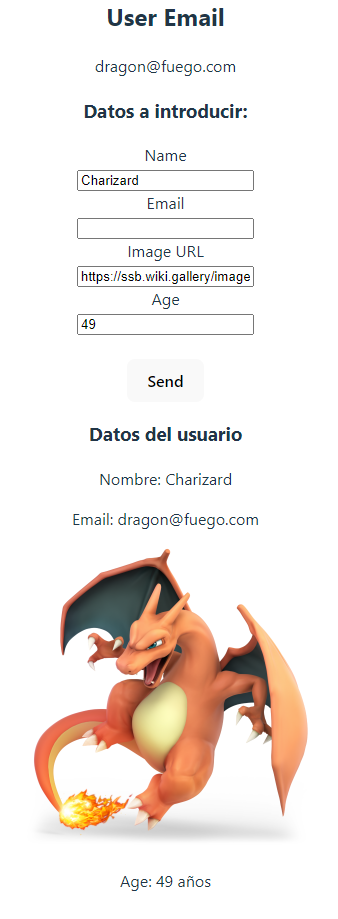

# react-exercise-components-comm

Hola a tod@s!

Os voy a ir contando paso a paso la funcionalidad de este ejercicio realizado con React!

Para iniciar el proyecto una vez hayais clonado el repositorio (en caso de que querais probarlo) debereis instalar las dependencias, utilizar el siguiente comando en vuestra terminal:

- npm run install

De esta forma os instalara todo lo necesario para que el proyecto pueda iniciarse!

a continuacion utilizar el siguiente comando para arrancar el proyecto:

- npm run dev

Ahora podreis navegar por el siguiente puerto establecido en vuestro local:

- http://localhost:5173/

- El proyecto es un formulario el cual mostrara los resultados que le introduzcas una vez pulses el boton de "Send", no dudes en utilizar una imagen real para que veas el resultado mas grafico!

- En el header te mostrará el email que introduciste

- Para la realizacion del proyecto he utilizado una comunicación de componentes en React, utilizando los siguientes React Hooks

- UseState, UseEffect, UseContext

- De esta manera me permite intercambiar cualquier tipo de informacion entre componentes tanto Padre, como hermanos.

- Imagen del resultado del proyecto:

